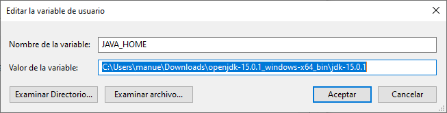
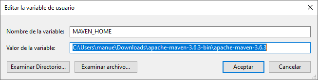
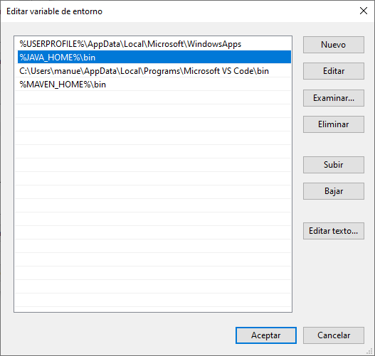
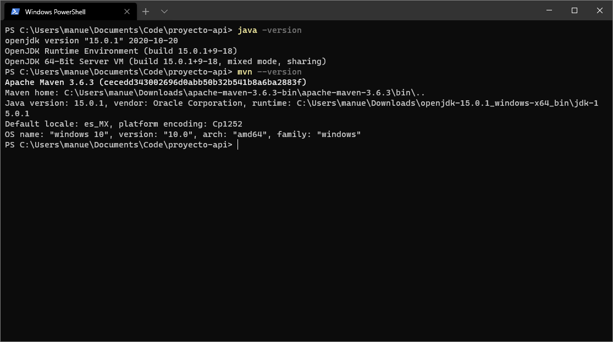
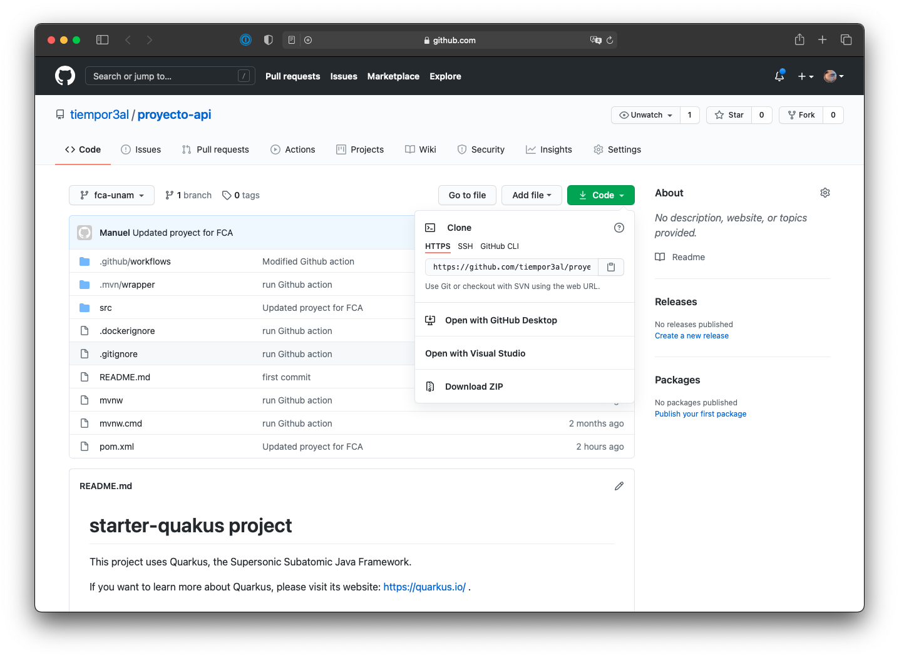
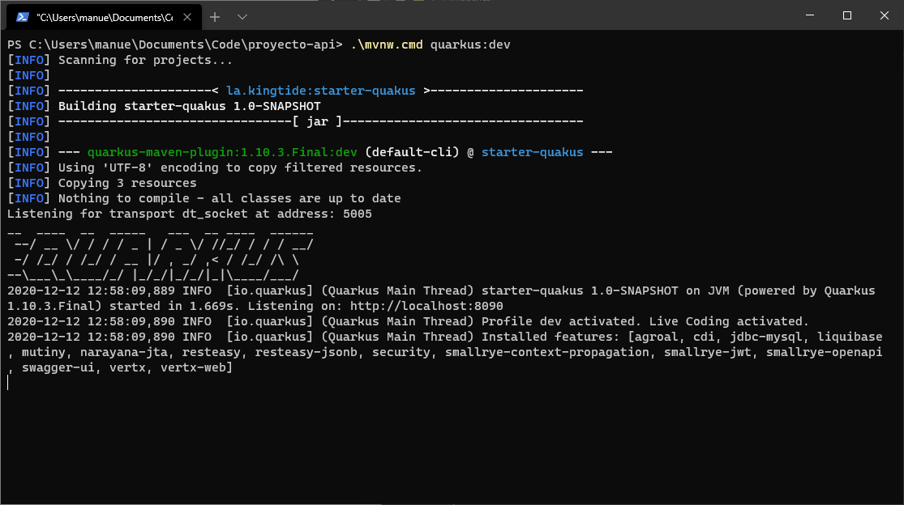
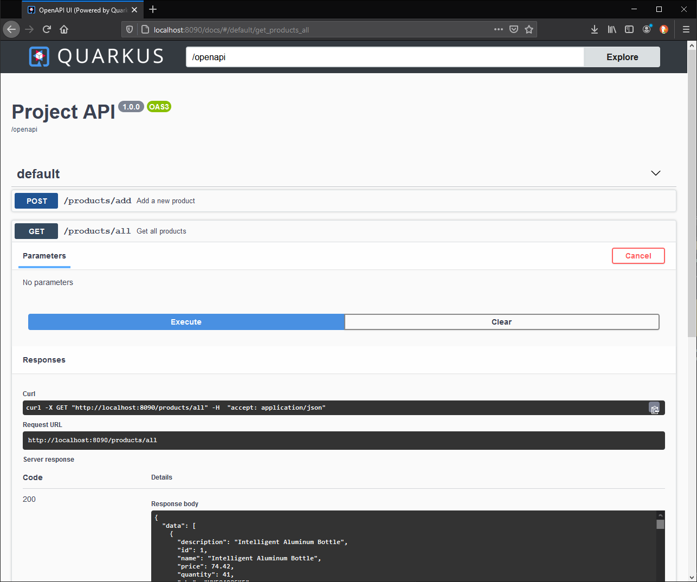

# Unidad 5 actividad complementaria
### 1) Instalación de Java y Maven
En Windows 10/11 deberás instalar Java 20, 21 y Maven
Nota, en las imágenes de esta guía, la version de Java es la 15.

Java

https://download.oracle.com/java/21/latest/jdk-21_windows-x64_bin.zip

Maven

https://downloads.apache.org/maven/maven-3/3.9.6/binaries/apache-maven-3.9.6-bin.zip

Deberás descomprimir cada archivo en una ubicación de tu elección y crear
las variables de ambiente JAVA_HOME y MAVEN_HOME como se muestra en estas imágenes.
Las rutas deberán ser modificadas a tu entorno.





Se deberá modificar la variable path y agregar las rutas %JAVA_HOME%\bin y %MAVEN_HOME%\bin



Para comprobar que se ha realizado correctamente la instalación, en una consola de PowerShell o Terminal,
teclear
```
java -version
```
y
```
mvn --version
```

La salida de cada comando deberá ser similar a la siguiente imagen


### 2) Descarga del proyecto

Deberás descargar el proyecto en zip de https://github.com/tiempor3al/proyecto-api, y descomprimirlo en la ubicación de tu elección.



### 3) Modificación de las credenciales de la base de datos

Para que el proyecto se conecte a la base de datos que tienen instalada en su equipo, deberán modificar el archivo application.properties
que se encuentra en /src/main/resources con los datos correspondientes a su base de datos:

```
quarkus.datasource.username = postgres
quarkus.datasource.password = postgres
quarkus.datasource.jdbc.url = jdbc:postgresql://localhost:5432/tienda
```

Para la url, la sintaxis es
```
jdbc:postgresql://<dirección_ip>:<puerto>/<nombre_de_la_base>
```
Por ejemplo para conectarse a la base de datos "prueba" en localhost, la sintáxis
de la url será:
```
jdbc:postgresql://localhost:5432/prueba
```
Nota: el puerto 5432 es el estándar para PostgreSQL

### 4) Compilación del proyecto

En PowerShell o Terminal, navegar al directorio donde se descargó el proyecto y ejecutar el comando:

```
./mvnw.cmd quarkus:dev
```

Este comando descargará las librerías requeridas para el proyecto, y ejecutará la aplicación Web en modo "desarrollo" en el puerto 8090.



El modo "desarrollo" habilita la opción "hot reload". Es decir, se pueden modificar los archivos y se recompilarán mientras se ejecuta la aplicación.

### 5) Actividades

a) Ejecutar la aplicación y navegar a http://localhost:8090 en el navegador de tu elección.


b) Navegar al explorador de Swagger integrado, con http://localhost:8090/docs



c) Ejecuta el endpoint GET /products/all. ¿Qué devuelve y en qué formato?

d) Prueba hacer una inserción a la tabla de productos, ejecutando el endpoint POST /product/add

e) Crea el endpoint /clients/all que muestre todos los clientes. Deberás tomar como referencia el endpoint GET /products/all.
Para ello deberás:

e.1) Crear el archivo ClientDto.java en la carpeta dto.
e.2) Modificar el archivo StoreDao.java para incluir el nuevo query getClients(). Deberás mapear ClienteDto de manera similar a:
```
@RegisterBeanMapper(ProductDto.class)
@SqlQuery("SELECT * FROM productos")
List<ProductDto> getProducts();
```


e.2.1) ¿Para qué sirve la directiva @RegisterBeanMapper (https://jdbi.org/#_beanmapper)?


e.2.2) ¿Qué deberá devolver el método getClients?


e.3) Deberás modificar el archivo StoreDal.java y crear el método getClients() de manera similar a:
```
public ResponseDto<List<ProductDto>> getProducts() {

        ResponseDto responseDto = new ResponseDto<List<ProductDto>>();
        responseDto.setSuccess(true);
        Jdbi jdbi = jdbiService.getInstance();
        var products = jdbi.withExtension(StoreDao.class, dao -> dao.getProducts());
        responseDto.setData(products);
        return responseDto;
    }
```

e.4) Deberás crear el archivo ClientsResource.java en la carpeta src/main/java/resources junto a ProductsResources.java
El archivo ClientsResource.java deberá contener un método getClients() similar a:
```
    @GET
    @Path("/all")
    @Produces(MediaType.APPLICATION_JSON)
    @Operation(summary = "Get all products")
    @APIResponses(value = {
            @APIResponse(responseCode = "200", content = @Content(mediaType = MediaType.APPLICATION_JSON)),
    })
    public Response getProducts() {

        var responseDto = storeDal.getProducts();
        return Response.ok(responseDto).build();
    }
```
Nota, el path
```
@Path("/products")
```
deberá ser modificado a clients en el archivo ClientsResource.java


e.5) Compila el proyecto con el comando
```
./mvnw.cmd clean compile
```
e.6) Y ejecútalo
```
./mvnw.cmd quarkus:dev
```
e.7) Navega a http://localhost:8090/docs y verifica que se muestra el nuevo endpoint. 
 

